<div align="center">




</div>

---

<div align="center">

### 🕵️ What is the Ghost Algorithm?

</div>

The **Ghost Algorithm** is an image generation technique to **encrypt transmitting data in visual format**.

- 🔲 **Version 1** transforms an input payload into a **black-and-white maze** using the proposed Ghost Algorithm.
- 🔮 **Future iterations** will improve on this to generate **complex images** for data encryption — making hidden data indistinguishable from visual noise.

---

<div align="center">

### ⚙️ How It Works

</div>

```
Input Payload  ──►  Ghost Algorithm  ──►  Encrypted Maze Image
```

> The algorithm encodes data into the structural pattern of a generated image, making the payload visually invisible yet mathematically recoverable.

---

<div align="center">

### 📋 Usage & Licensing

</div>

> **Free use of this software** — including integrating it into other systems or building on top of it — is **permitted upon prior approval.**
> Please reach out if you'd like to use this in your projects.

To request permission, open a [GitHub Issue](../../issues) or contact the author directly.

---

<div align="center">

### 🚀 Roadmap

</div>

| Version | Feature | Status |
|---|---|---|
| v1.0 | Black-and-white maze generation | ✅ Complete |
| v2.0 | Grayscale complexity layer | 🔄 Planned |
| v3.0 | Full-color steganographic images | 🔄 Planned |
| v4.0 | Real-time encryption pipeline | 🔄 Planned |

---

<div align="center">

*Built with intent. Hidden in plain sight.*

</div>
